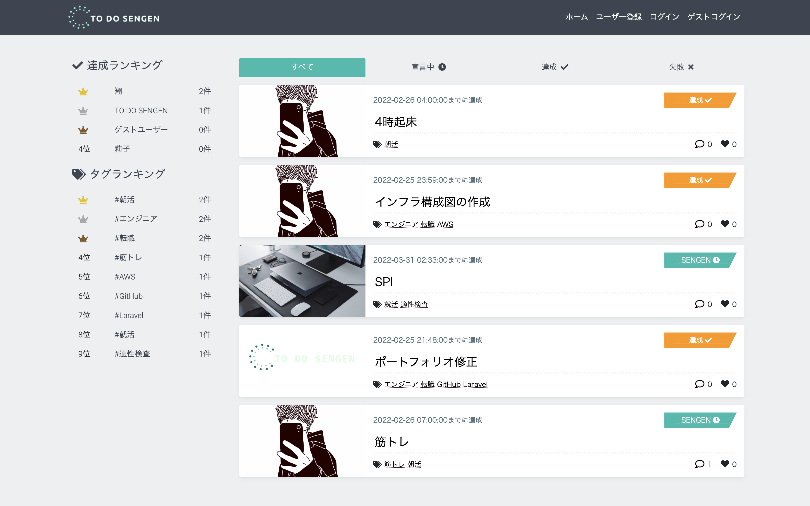

<!-- # SNS型ToDoリスト共有アプリ『TO DO SENGEN』 -->
# **TO DO SENGEN**
<!-- 「あなたの積読を解消します!」をスローガンに掲げた無料ブラウザアプリです。

"読書メンタルマップ術"という手法を用いて、ユーザーの書籍完読に向けたモチベーション維持をサポートします。 -->

**日々のタスクを『SENGEN』することで、ユーザーのタスク達成をサポートするSNS型ToDo管理アプリです。**

URL: https://to-do-sengen.com

・ゲストログイン機能搭載

・レスポンシブWebデザイン（PC推奨）

アプリの概要や作成背景を説明します。アプリの概要や作成背景を説明します。アプリの概要や作成背景を説明します。アプリの概要や作成背景を説明します。アプリの概要や作成背景を説明します。アプリの概要や作成背景を説明します。アプリの概要や作成背景を説明します。アプリの概要や作成背景を説明します。アプリの概要や作成背景を説明します。アプリの概要や作成背景を説明します。アプリの概要や作成背景を説明します。アプリの概要や作成背景を説明します。アプリの概要や作成背景を説明します。アプリの概要や作成背景を説明します。アプリの概要や作成背景を説明します。アプリの概要や作成背景を説明します。アプリの概要や作成背景を説明します。

## **使用画面のイメージ**

### **解説記事**( Qiita )
<!-- URL: https://qiita.com/ddpmntcpbr/items/739dbb992b5ffac3fc2f -->

URL: 記事作成予定

開発の背景から解説しています。

### **開発者Twitter**
<!-- URL: https://twitter.com/ddpmntcpbr -->

[NULL/ナル@IT業界1年生](https://twitter.com/_NULL_000000_)

ご用の方はこちらまで！

## **使用技術**
- **フロントエンド**
  - **Vue.js**
  - **jQuery**
  - **HTML / CSS / Sass / MDBootstrap**
- **バックエンド**
  - **PHP**
  - **Laravel**
  - **PHPUnit**
  - **Google Cloud Platform**
  - **Twitter API**
- **インフラ**
  - **AWS**
  - **Docker**
  - **Circle CI**
  - **nginx**
  - **MySQL**

## **インフラ構成図**

## DB設計
### ER図

### 各テーブルについて
| テーブル名   | 説明                                |
|:-:           |:-:                                  |
| users        | 登録ユーザー情報                    |
| follows      | フォロー中/フォロワーのユーザー情報 |
| articles     | ユーザー投稿情報                    |
| achievements | ユーザー投稿の達成チェック情報      |
| tags         | ユーザー投稿のタグ情報              |
| article_tag  | articlesとtagsの中間テーブル        |
| likes        | ユーザー投稿のいいね情報            |
| comments     | ユーザー投稿のコメント情報          |

## **機能一覧**
- **ユーザー登録関連**
  - ユーザー登録・ログイン・ログアウト
  - ゲストログイン機能
  - Googleアカウントを利用したユーザー登録・ログイン機能
    - GCP（Google Cloud Platform）のOAuth認証
  - Twitterアカウントを利用したユーザー登録・ログイン機能
    - TwitterのOAuth認証
  - プロフィール編集機能
  - メールアドレス変更機能（SendGrid）
  - パスワード再設定・変更機能（SendGrid）
- **ユーザー投稿関連**（CRUD）
- **SENGEN達成のチェック機能**（CRUD）
- **ランキング機能**
  - ユーザー投稿達成数
  - ユーザー投稿タグ数
- **ページネーション機能**
- **コメント機能**（CRUD）
- **タグ機能**（Vue.js / Vue Tags Input）
- **いいね機能**（Vue.js / ajax）
- **フォロー機能**
- **検索機能**
  - キーワード検索
  - ソート検索（昇順、降順、いいね順、コメント数順）
  - カテゴリ検索
    - ユーザー投稿一覧画面（すべて、宣言中、達成、失敗）
    - ユーザー詳細画面（SENGEN、いいね、フォロー、フォロワー）
- **画像アップロード機能**（AWS S3バケット）
- **お問い合わせ機能**（SendGrid）
- **PHPUnitテスト**
- **レスポンシブWebデザイン**
  - ハンバーガーメニュー（Vue.js）
