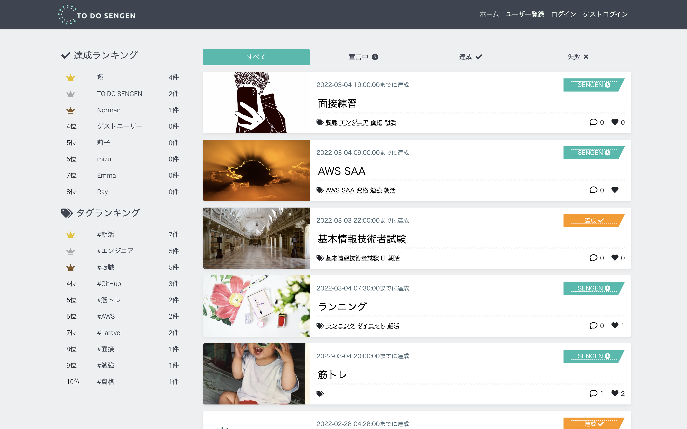

# **TO DO SENGEN**
**日々のタスクを『SENGEN』することで、ユーザーのタスク達成をサポートするSNS型ToDo管理アプリです。**

URL: https://to-do-sengen.com

・ゲストログイン機能搭載

・レスポンシブWebデザイン（PC推奨）

 
 

# **アプリ概要**
## **コンセプト**

- 目標を宣言することによるプレッシャーを有効活用し、ユーザーの目標達成をサポートする
- 『SENGEN』を達成するまでの過程をユーザー同士で共有し、お互いに高め合う環境を提供する

## **特徴**
- 『SENGEN』を達成するまでの努力過程を発信、共有できる
- 『SENGEN』投稿をカテゴリ別で表示する
- 『SENGEN』を達成できた要因や、失敗した原因の分析結果を発信、共有できる

## **解説記事**( Qiita )
URL: https://qiita.com/NULL_000000/items/b5c06cca2dd17e4dd00b

開発の背景から解説しています。
 
 

# **使用画面のイメージ**

# **使用技術**
- **フロントエンド**
  - **Vue.js 2.6.12**
  - **jQuery 3.4.1**
  - **HTML / CSS / Sass / MDBootstrap**
- **バックエンド**
  - **PHP 7.4.25**
  - **Laravel 6.20.41**
  - **PHPUnit 8.0**
- **インフラ**
  - **AWS ( EC2, ALB, ACM, S3, RDS, CodeDeploy, SNS, Chatbot, Route53, VPC, EIP, IAM )**
  - **Docker 20.10.11 / docker-compose 2.2.1**（開発環境）
  - **Circle CI 2.1**
  - **nginx 1.12.2**
  - **MySQL 5.5.68**

# **インフラ構成図**

 
 

# **DB設計**
## **ER図**

 
 

## **各テーブルについて**
| テーブル名   | 説明                                |
|:-:           |:-:                                  |
| users        | 登録ユーザー情報                    |
| follows      | フォロー中/フォロワーのユーザー情報 |
| articles     | ユーザー投稿情報                    |
| achievements | ユーザー投稿の達成チェック情報      |
| tags         | ユーザー投稿のタグ情報              |
| article_tag  | articlesとtagsの中間テーブル        |
| likes        | ユーザー投稿のいいね情報            |
| comments     | ユーザー投稿のコメント情報          |
 
 

# **機能一覧**
- **ユーザー登録関連**
  - ユーザー登録・ログイン・ログアウト
  - ゲストログイン機能
  - Googleアカウントを利用したユーザー登録・ログイン機能
    - GCP（Google Cloud Platform）のOAuth認証
  - Twitterアカウントを利用したユーザー登録・ログイン機能
    - TwitterのOAuth認証
  - プロフィール編集機能
  - メールアドレス変更機能（SendGrid）
  - パスワード再設定・変更機能（SendGrid）
- **ユーザー投稿機能**（CRUD）
- **SENGEN達成のチェック機能**（CRUD）
- **ランキング機能**
  - ユーザー投稿達成数
  - ユーザー投稿タグ数
- **ページネーション機能**
- **コメント機能**（CRUD）
- **タグ機能**（Vue.js / Vue Tags Input）
- **いいね機能**（Vue.js / axios）
- **フォロー機能**（Vue.js / axios）
- **検索機能**
  - キーワード検索
  - ソート検索（昇順、降順、いいね順、コメント数順）
  - カテゴリ検索
    - ユーザー投稿一覧画面（すべて、宣言中、達成、失敗）
    - ユーザー詳細画面（SENGEN、いいね、フォロー、フォロワー）
- **画像アップロード機能**（AWS S3バケット）
- **お問い合わせ機能**（SendGrid）
- **PHPUnitテスト**
- **レスポンシブWebデザイン**
  - ハンバーガーメニュー（Vue.js / axios）
 
 

# **作者**
- Kakeru Sasaki
- Twitterアカウント：[NULL/ナル@IT業界1年生](https://twitter.com/_NULL_000000_)
